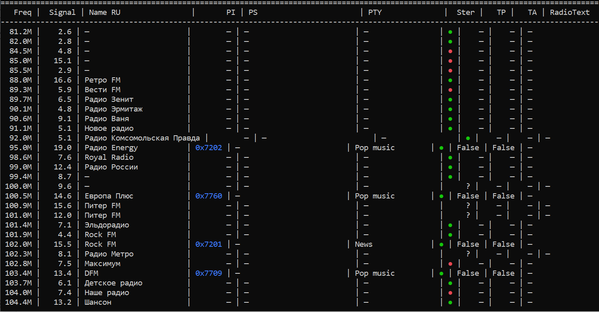
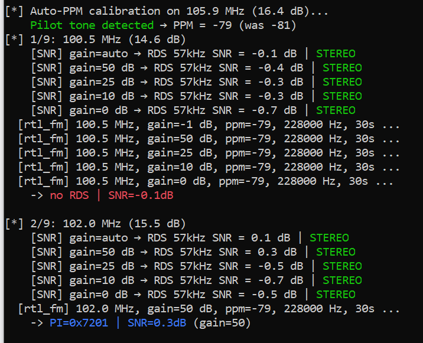

# SDR RTL FM RDS Scanner

Мощный инструмент для автоматического сканирования FM-диапазона (87.5–108.0 МГц) и сбора данных RDS (Radio Data System) с помощью RTL-SDR приёмника. Проект ориентирован на создание и актуализацию базы радиостанций Санкт-Петербурга (SPB), но легко адаптируется под любой регион.

**Ключевая особенность:** проект использует связку `rtl_fm` (для захвата сигнала) + **RedSea** (для декодирования RDS), что обеспечивает высокую точность распознавания PI-кодов и текста станций даже при слабом сигнале.

## 🎯 Что умеет сканер

- **Автоматическое сканирование диапазона** с заданным шагом и временем задержки на каждой частоте.
- **Декодирование RDS через RedSea**: надёжное извлечение PI-кодов, PS (Program Service) и RT (Radio Text).
- **Фильтрация и структурирование**: сохранение только валидных станций с метаданными (частота, PI, PS, RT).
- **Гибкая настройка регионов**: поддержка разных географических зон через JSON-конфигурации.
- **Игнорирование временных файлов**: `.gitignore` настроен так, чтобы в репозиторий попадала только база, а не ежедневные логи сканирования.

## 📸 Примеры работы

Ниже показано, как выглядит вывод сканера и итоговая база данных.

### Вывод в терминале

*Рис. 1: Реальный вывод в терминале: видны частоты и найденные RDS-пакеты.*

### Фрагмент базы RDS (JSON)

*Рис. 2: Фрагмент процесса сканирования*

## 📦 Требования

### Аппаратное обеспечение
- RTL-SDR приёмник (например, RTL2832U).

### Программное обеспечение (ОС: Linux)
- **Python 3.x** и необходимые библиотеки.
- **RedSea** — консольный декодер RDS (обязателен!).
- **rtl-sdr** утилиты (в частности, `rtl_fm`).

Тестировалось на Ubuntu 26.04LTS

### Установка зависимостей

1. **Библиотеки Python:**
   ```bash
   pip install pyrtlsdr numpy pandas

    RedSea и rtl-sdr утилиты:

    Вариант А (через пакетный менеджер — рекомендуется для Ubuntu/Debian):

    bash

    sudo apt update
    sudo apt install librtlsdr-dev rtl-sdr
    # RedSea часто нет в стандартных репозиториях, ставим через snap или сборку
    sudo snap install redsea

    Вариант Б (сборка RedSea из исходников — если snap недоступен):

    bash

    git clone https://github.com/Osso/redsea.git
    cd redsea
    mkdir build && cd build
    cmake ..
    make
    sudo make install

        ⚠️ Важно: После установки убедись, что команды rtl_fm и redsea доступны в терминале. Проверь это так:

        bash

        rtl_fm -h
        redsea -h

        Если терминал пишет «command not found», значит, путь к исполняемым файлам не добавлен в переменную \$PATH.

🚀 Быстрый старт

    Убедись, что RedSea и rtl_fm установлены (см. блок выше).
    Клонируй репозиторий (или убедись, что ты уже в папке проекта).
    Проверь конфигурацию региона в папке regions/. Для Санкт-Петербурга используется spb.json.
    Запусти сканер:

    bash

    python3 SDR_RTL_FM_RDS_Scaner.py

    Дождись завершения сканирования. Результаты сохранятся в data/SDR_FM_RDS_Base_spb.json.

    ⚠️ Важно: Для работы сканера необходимы права на доступ к USB-устройству. Если возникают ошибки доступа, попробуй запустить скрипт с sudo или настрой udev-правила для RTL-SDR.

🗺️ Настройка под свой регион

Чтобы сканировать другой город или диапазон частот:

    Создай новый JSON-файл в папке regions/ (например, msk.json).
    Укажи в нём параметры:

    json

    {
      "name": "Moscow",
      "frequency_start": 87.5,
      "frequency_end": 108.0,
      "step_khz": 50,
      "dwell_seconds": 25,
      "ppm_offset": -60
    }

    В коде скрипта (SDR_RTL_FM_RDS_Scaner.py) укажи путь к этому файлу или передай его как аргумент.

📁 Структура проекта

    data/ — здесь хранятся базы станций и временные файлы (игнорируются Git).
    regions/ — конфигурации для разных регионов (диапазоны, шаги, PPM).
    SDR_RTL_FM_RDS_Scaner.py — основной скрипт сканера.
    .gitignore — настроен для исключения временных логов сканирования.
    LICENSE — лицензия MIT (свободное использование и модификация).

🤝 Как помочь проекту

Проект открыт для вклада сообщества! Ты можешь:

    Добавить конфигурации для новых регионов.
    Оптимизировать алгоритм поиска RDS-пакетов.
    Написать документацию по установке на Windows/macOS.
    Предложить новые функции (например, визуализацию покрытия или экспорт в CSV).

Отправь Pull Request или оставь Issue — буду рад любой помощи!
📜 Лицензия

Проект распространяется под лицензией MIT. Подробности в файле LICENSE.

